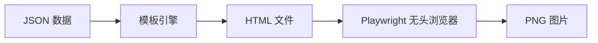

## 1. 模块概述

本模块负责将爬取到的 GitHub Trending 数据渲染成精美的卡片图片，用于小红书发布。

### 目标

- 将 Top 10 项目数据渲染为 10 张独立的卡片图片
- 卡片风格适配小红书审美（极简风/INS 风）
- 图片尺寸符合小红书推荐比例（3:4 或 1:1）

### 数据流向



---

## 2. 技术方案选型

### Node.js 方案对比

| 方案 | 原理 | 设计灵活性 | 性能 | 依赖体积 | 推荐场景 |
|------|------|-----------|------|----------|----------|
| **Playwright** | HTML + 浏览器截图 | ⭐⭐⭐⭐⭐ | ⭐⭐⭐ | ~300MB | 设计要求高 |
| Satori + Sharp | JSX → SVG → PNG | ⭐⭐⭐⭐ | ⭐⭐⭐⭐⭐ | ~15MB | Serverless |
| Puppeteer | HTML + Chrome 截图 | ⭐⭐⭐⭐⭐ | ⭐⭐⭐ | ~300MB | 老牌稳定 |

### 最终选型：Playwright

**选择理由：**

1. **设计上限高**：HTML/CSS 可实现任意复杂的排版、渐变、阴影、圆角等效果
2. **调试便捷**：直接在浏览器中预览和调试样式
3. **API 更现代**：比 Puppeteer 更简洁，自动等待机制更智能
4. **与项目统一**：保持 TypeScript 技术栈一致性

---

## 3. 技术栈明细

| 组件 | 技术选择 | 版本要求 | 用途 |
|------|----------|----------|------|
| 浏览器自动化 | Playwright | ≥1.40 | 无头浏览器截图 |
| CSS 框架 | Tailwind CSS (CDN) | 3.x | 快速样式开发 |
| 字体 | 思源黑体 / Noto Sans SC | - | 中文显示 |

**安装命令：**

```bash
pnpm add -D playwright
pnpm exec playwright install chromium
```

---

## 4. 目录结构

```text
src/
├── renderer/
│   ├── index.ts            # 导出入口
│   ├── card-renderer.ts    # 核心渲染逻辑
│   └── templates/
│       └── card.html       # 卡片模板
├── output/
│   └── cards/              # 生成的图片输出目录
tests/
└── renderer.test.ts        # 渲染器测试
```

---

## 5. 详细实现流程

### Phase 1: 类型定义

复用现有的 `TrendingRepo` 类型：

```typescript
// src/types.ts (已存在，扩展即可)
export interface TrendingRepo {
  rank: number;
  owner: string;
  name: string;
  url: string;
  description: string;
  language: string;
  stars: string;
  forks: string;
  todayStars: string;
}
```

### Phase 2: 设计 HTML 模板

**src/renderer/templates/card.html:**

```html
<!DOCTYPE html>
<html>
<head>
  <meta charset="UTF-8">
  <script src="https://cdn.tailwindcss.com"></script>
  <link href="https://fonts.googleapis.com/css2?family=Noto+Sans+SC:wght@400;700&display=swap" rel="stylesheet">
  <style>
    * { font-family: 'Noto Sans SC', sans-serif; }
  </style>
</head>
<body class="bg-gray-100 flex items-center justify-center min-h-screen">
  <div class="card bg-white rounded-3xl shadow-2xl p-12 flex flex-col" id="card">

    <!-- 排名标签 -->
    <div class="flex items-center gap-4 mb-8">
      <span class="bg-gradient-to-r from-purple-500 to-pink-500 text-white text-4xl font-bold px-6 py-3 rounded-2xl">
        TOP {{rank}}
      </span>
      <span class="text-gray-400 text-2xl">GitHub Trending</span>
    </div>

    <!-- 项目名称 -->
    <h1 class="text-5xl font-bold text-gray-800 mb-4">
      {{name}}
    </h1>
    <p class="text-2xl text-gray-500 mb-8">by {{owner}}</p>

    <!-- 项目描述 -->
    <p class="text-3xl text-gray-700 leading-relaxed flex-grow">
      {{description}}
    </p>

    <!-- 底部统计信息 -->
    <div class="flex items-center gap-8 mt-auto pt-8 border-t border-gray-200">
      <!-- 语言 -->
      <div class="flex items-center gap-2">
        <span class="w-4 h-4 rounded-full" style="background-color: {{languageColor}}"></span>
        <span class="text-2xl text-gray-600">{{language}}</span>
      </div>

      <!-- Stars -->
      <div class="flex items-center gap-2">
        <svg class="w-8 h-8 text-yellow-500" fill="currentColor" viewBox="0 0 20 20">
          <path d="M9.049 2.927c.3-.921 1.603-.921 1.902 0l1.07 3.292a1 1 0 00.95.69h3.462c.969 0 1.371 1.24.588 1.81l-2.8 2.034a1 1 0 00-.364 1.118l1.07 3.292c.3.921-.755 1.688-1.54 1.118l-2.8-2.034a1 1 0 00-1.175 0l-2.8 2.034c-.784.57-1.838-.197-1.539-1.118l1.07-3.292a1 1 0 00-.364-1.118L2.98 8.72c-.783-.57-.38-1.81.588-1.81h3.461a1 1 0 00.951-.69l1.07-3.292z"/>
        </svg>
        <span class="text-2xl font-semibold text-gray-700">{{stars}}</span>
      </div>

      <!-- Today Stars -->
      <div class="text-2xl text-green-600 font-medium">
        +{{todayStars}} today
      </div>
    </div>

  </div>
</body>
</html>
```

### Phase 3: 核心渲染逻辑

**src/renderer/card-renderer.ts:**

```typescript
import { chromium, Browser, BrowserContext } from 'playwright';
import * as fs from 'fs';
import * as path from 'path';
import { TrendingRepo } from '../types.js';

// 语言颜色映射
const LANGUAGE_COLORS: Record<string, string> = {
  TypeScript: '#3178c6',
  JavaScript: '#f1e05a',
  Python: '#3572A5',
  Rust: '#dea584',
  Go: '#00ADD8',
  Java: '#b07219',
  'C++': '#f34b7d',
  C: '#555555',
  Ruby: '#701516',
  Swift: '#F05138',
  Kotlin: '#A97BFF',
  // 默认颜色
  default: '#8b8b8b',
};

export class CardRenderer {
  private browser: Browser | null = null;
  private context: BrowserContext | null = null;
  private templatePath: string;
  private templateContent: string;

  constructor(templatePath?: string) {
    this.templatePath = templatePath || path.join(__dirname, 'templates', 'card.html');
    this.templateContent = fs.readFileSync(this.templatePath, 'utf-8');
  }

  /**
   * 初始化浏览器（复用实例）
   */
  async init(): Promise<void> {
    if (!this.browser) {
      this.browser = await chromium.launch();
      this.context = await this.browser.newContext({
        viewport: { width: 1200, height: 1600 },
        deviceScaleFactor: 2, // 2x 分辨率，更清晰
      });
    }
  }

  /**
   * 关闭浏览器
   */
  async close(): Promise<void> {
    if (this.browser) {
      await this.browser.close();
      this.browser = null;
      this.context = null;
    }
  }

  /**
   * 渲染单张卡片
   */
  async renderCard(repo: TrendingRepo, outputPath: string): Promise<string> {
    if (!this.context) {
      throw new Error('Browser not initialized. Call init() first.');
    }

    // 1. 填充模板
    const languageColor = LANGUAGE_COLORS[repo.language] || LANGUAGE_COLORS.default;
    const html = this.templateContent
      .replace(/\{\{rank\}\}/g, String(repo.rank))
      .replace(/\{\{name\}\}/g, repo.name)
      .replace(/\{\{owner\}\}/g, repo.owner)
      .replace(/\{\{description\}\}/g, repo.description || 'No description')
      .replace(/\{\{language\}\}/g, repo.language || 'Unknown')
      .replace(/\{\{languageColor\}\}/g, languageColor)
      .replace(/\{\{stars\}\}/g, repo.stars)
      .replace(/\{\{todayStars\}\}/g, repo.todayStars.replace(/[^\d,]+/g, ''));

    // 2. 创建页面并加载 HTML
    const page = await this.context.newPage();
    await page.setContent(html, { waitUntil: 'networkidle' });

    // 3. 截图卡片元素
    const cardElement = await page.$('#card');
    if (!cardElement) {
      throw new Error('Card element not found');
    }

    // 确保输出目录存在
    const outputDir = path.dirname(outputPath);
    if (!fs.existsSync(outputDir)) {
      fs.mkdirSync(outputDir, { recursive: true });
    }

    await cardElement.screenshot({ path: outputPath, type: 'png' });
    await page.close();

    return outputPath;
  }

  /**
   * 批量渲染所有卡片
   */
  async renderAll(repos: TrendingRepo[], outputDir: string = 'output/cards'): Promise<string[]> {
    const results: string[] = [];

    for (const repo of repos) {
      const outputPath = path.join(outputDir, `top${repo.rank}.png`);
      await this.renderCard(repo, outputPath);
      results.push(outputPath);
      console.log(`Generated: ${outputPath}`);
    }

    return results;
  }
}

/**
 * 便捷函数：一次性渲染所有卡片
 */
export async function renderCards(repos: TrendingRepo[], outputDir?: string): Promise<string[]> {
  const renderer = new CardRenderer();
  try {
    await renderer.init();
    return await renderer.renderAll(repos, outputDir);
  } finally {
    await renderer.close();
  }
}
```

### Phase 4: 导出入口

**src/renderer/index.ts:**

```typescript
export { CardRenderer, renderCards } from './card-renderer.js';
```

### Phase 5: 集成到主流程

**src/index.ts (更新):**

```typescript
import { fetchTrending } from './scraper.js';
import { renderCards } from './renderer/index.js';

async function main() {
  // 1. 爬取数据
  console.log('Fetching GitHub Trending...');
  const repos = await fetchTrending();
  console.log(`Fetched ${repos.length} repositories`);

  // 2. 渲染卡片
  console.log('Rendering cards...');
  const cardPaths = await renderCards(repos);
  console.log(`Generated ${cardPaths.length} cards:`);
  cardPaths.forEach((p) => console.log(`  - ${p}`));
}

main().catch(console.error);
```

---

## 6. 性能优化

### 6.1 浏览器实例复用

已在 `CardRenderer` 类中实现。使用 `init()` 和 `close()` 方法管理生命周期。

### 6.2 并发渲染

```typescript
async renderAllConcurrent(repos: TrendingRepo[], outputDir: string): Promise<string[]> {
  // 限制并发数为 3，避免内存溢出
  const concurrency = 3;
  const results: string[] = [];

  for (let i = 0; i < repos.length; i += concurrency) {
    const batch = repos.slice(i, i + concurrency);
    const batchResults = await Promise.all(
      batch.map((repo) => {
        const outputPath = path.join(outputDir, `top${repo.rank}.png`);
        return this.renderCard(repo, outputPath);
      })
    );
    results.push(...batchResults);
  }

  return results;
}
```

### 6.3 字体预加载

将字体下载到本地，避免网络请求：

```html
<style>
  @font-face {
    font-family: 'Noto Sans SC';
    src: url('file://{{fontPath}}/NotoSansSC-Regular.ttf') format('truetype');
  }
</style>
```

---

## 7. 测试策略

**tests/renderer.test.ts:**

```typescript
import { describe, it, expect, beforeAll, afterAll } from 'vitest';
import { CardRenderer } from '../src/renderer/card-renderer.js';
import { TrendingRepo } from '../src/types.js';
import * as fs from 'fs';
import * as path from 'path';
import * as os from 'os';

describe('CardRenderer', () => {
  let renderer: CardRenderer;
  let tempDir: string;

  const mockRepo: TrendingRepo = {
    rank: 1,
    owner: 'test-owner',
    name: 'test-repo',
    url: 'https://github.com/test-owner/test-repo',
    description: 'A test repository for unit testing',
    language: 'TypeScript',
    stars: '1.5k',
    forks: '100',
    todayStars: '50 stars today',
  };

  beforeAll(async () => {
    renderer = new CardRenderer();
    await renderer.init();
    tempDir = fs.mkdtempSync(path.join(os.tmpdir(), 'card-test-'));
  });

  afterAll(async () => {
    await renderer.close();
    fs.rmSync(tempDir, { recursive: true });
  });

  it('should render a single card', async () => {
    const outputPath = path.join(tempDir, 'test-card.png');
    const result = await renderer.renderCard(mockRepo, outputPath);

    expect(result).toBe(outputPath);
    expect(fs.existsSync(outputPath)).toBe(true);
    expect(fs.statSync(outputPath).size).toBeGreaterThan(0);
  });

  it('should render multiple cards', async () => {
    const repos = Array.from({ length: 3 }, (_, i) => ({
      ...mockRepo,
      rank: i + 1,
      name: `repo-${i + 1}`,
    }));

    const results = await renderer.renderAll(repos, tempDir);

    expect(results).toHaveLength(3);
    results.forEach((p) => {
      expect(fs.existsSync(p)).toBe(true);
    });
  });
});
```

---

## 8. 部署集成

### 更新 package.json scripts

```json
{
  "scripts": {
    "start": "tsx src/index.ts",
    "render": "tsx src/renderer/index.ts",
    "test": "vitest",
    "postinstall": "playwright install chromium"
  }
}
```

### GitHub Actions 配置更新

```yaml
jobs:
  build:
    runs-on: ubuntu-latest
    steps:
      - uses: actions/checkout@v4

      - name: Setup Node
        uses: actions/setup-node@v4
        with:
          node-version: '20'

      - name: Setup pnpm
        uses: pnpm/action-setup@v2
        with:
          version: 8

      - name: Install Dependencies
        run: pnpm install

      - name: Install Playwright Browsers
        run: pnpm exec playwright install chromium --with-deps

      - name: Run Scraper & Renderer
        run: pnpm start

      - name: Upload Cards
        uses: actions/upload-artifact@v4
        with:
          name: weekly-cards
          path: output/cards/*.png
```

---

## 9. 检查清单

实施前请确认：

- [ ] Node.js 20+ 已安装
- [ ] 执行 `pnpm add -D playwright`
- [ ] 执行 `pnpm exec playwright install chromium`
- [ ] 创建 `src/renderer/templates/card.html`
- [ ] 创建 `src/renderer/card-renderer.ts`
- [ ] 更新 `src/index.ts` 集成渲染流程
- [ ] 运行测试验证功能
